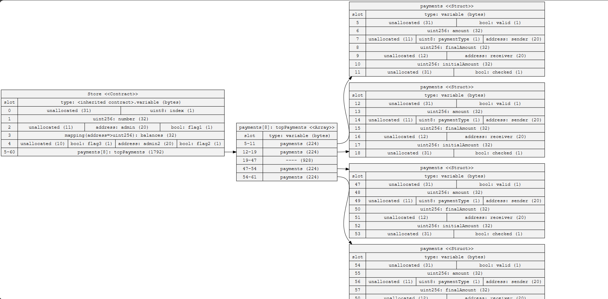
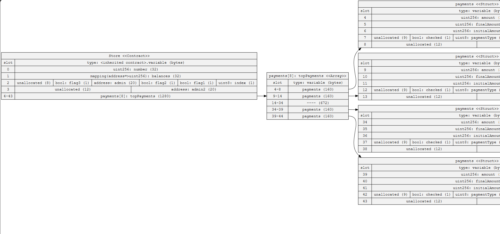

## Homework 4 - Optimising Storage

- Take this contract, use the sol2uml tool to find out how many storage slots it is using. By re ordering the variables, can you reduce the number of
storage slots needed ?

## Solution

- You need a config solum2tool locally, a suggestion, you could install globally: https://github.com/naddison36/sol2uml
- To generate the class diagram: 
```
sol2uml class src/Store.sol
```
- To generate the storage slot report: 
```
sol2uml storage src/Store.sol --contract Store
```

# Reports

- Memory slot before the optomization:


- Memory slot after the optomization:


<hr/>

**Foundry is a blazing fast, portable and modular toolkit for Ethereum application development written in Rust.**

Foundry consists of:

-   **Forge**: Ethereum testing framework (like Truffle, Hardhat and DappTools).
-   **Cast**: Swiss army knife for interacting with EVM smart contracts, sending transactions and getting chain data.
-   **Anvil**: Local Ethereum node, akin to Ganache, Hardhat Network.
-   **Chisel**: Fast, utilitarian, and verbose solidity REPL.

## Documentation

https://book.getfoundry.sh/

## Usage

### Build

```shell
$ forge build
```

### Test

```shell
$ forge test
```

### Format

```shell
$ forge fmt
```

### Gas Snapshots

```shell
$ forge snapshot
```

### Anvil

```shell
$ anvil
```

### Deploy

```shell
$ forge script script/Counter.s.sol:CounterScript --rpc-url <your_rpc_url> --private-key <your_private_key>
```

### Cast

```shell
$ cast <subcommand>
```

### Help

```shell
$ forge --help
$ anvil --help
$ cast --help
```
